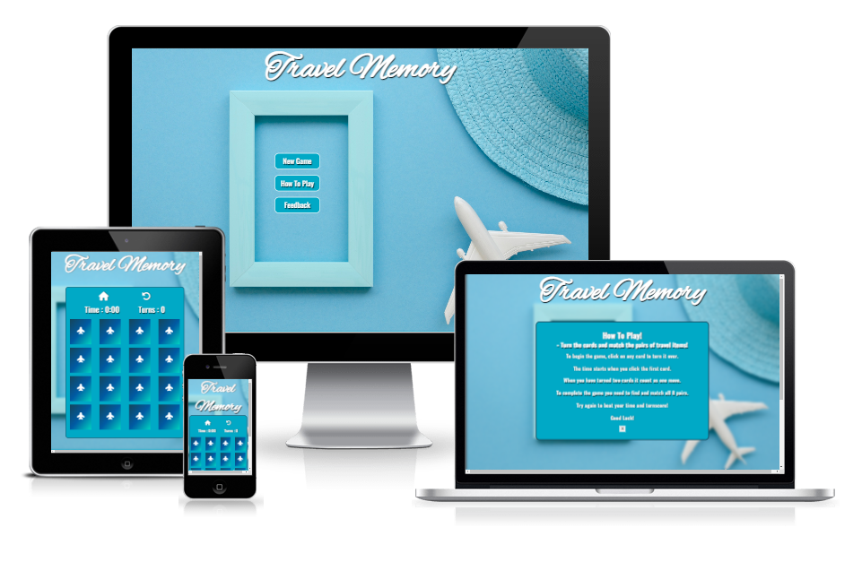

# Travel Memory

Travel Memory is a travel themed memory game where the user should pair together different items related to traveling. 
Its for people who wants to play a quick and easy game while also training their memory at the same time. The game also has a timer and turnscore for the people who wish to improve their result, or to compete against others.  
The game is designed for users of any age to play and enjoy. 

### [View the live website here](https://moolleer.github.io/travel-memory-game/)

## Features

### Design

- The design of the website was thoughtout to match the images and background.
- A white text color with text shadow is used to give a good contrast against the blue background. 
- The color palette for the website was generated from [My Color](https://mycolor.space/) and I used color #00A9C6. 

### Existing Features

Homepage
- The homepage is presented by three button options. The user can start a new game, read game instructions or leave feedback.

How To Play
- Shows the user a message with instructions on how to play the game.

The Game
- The game consists of 16 cards on a 4x4 grid. At the top there is a home button represented by a home icon, and a restart game button represented by a rounded arrow icon for the users understanding on how to navigate.
- Game starts when the user clicks on any card. The cursor also turns into a pointer when hovering over the cards for the user experience. When a card has been clicked, the timer starts and the turnscore counts every time the second card have been checked for a match. If there is a match, the card stays turned. The user could also reset the game at any time by clicking the reset button. Then the cards that have been matched turns back and the timer and turnscore stops and resets to the initial state. When the home button is clicked the game finishes and returns to the home page. 

Finished Game
- When the user have matched all pairs a message is presented with the time and turnscore. Then the user can decide to play again or to close the window.

Feedback
- The user can leave some feedback by writing their name, email and a textmessage. All input fields must be filled out and a email for the form to be submited.

### Future Features
- For future features I would like to add a high score bord to the game. The user would then be able to add their name and record their turnscores and time.
- Adding sound animation for flipping cards, and when the user tries to click on a card when the game grid is locked.

## Testing

All testing information can be found here [testing.md](https://github.com/moolleer/travel-memory-game/blob/main/docs/testing.md)

## Deployment

The project has been deployed to GitHub pages taking the following steps:

1) In the Github project repository, click on _Settings_.
2) From the Settings menu, locate _Pages_.
3) Under Branch, select _Main_ branch.
4) Click _Save_, and the page will then automatically refresh with a link to the deployed site.

The live link: https://moolleer.github.io/travel-memory-game/

## Credits & Content

- To convert an image to favicon i used [Zamzar](https://www.zamzar.com/convert/png-to-ico/#).
- For how to set the effect for hovering over the buttons I used the code from [Sliderrevolution](https://www.sliderrevolution.com/resources/css-button-hover-effects/).
- Inspiration for how to create the memory grid from [Codewithrandom](https://www.codewithrandom.com/2022/11/05/memory-game-using-javascript/).
- Inspiration for how to create the memory cards [Codingartistweb](https://codingartistweb.com/2022/06/memory-game-javascript-project/).
- For turning the cards function I used an example from [Marina Ferreira](https://marina-ferreira.github.io/tutorials/js/memory-game/).
- How to set a timer function I found [Dev](https://dev.to/walternascimentobarroso/creating-a-timer-with-javascript-8b7).
- Code institutes love running README file template as a inspiration for the README file.

### Media

- The images for the cards comes from [Freepik](https://www.freepik.com/free-vector/tourism-icons_772926.htm#page=11&query=travel%20stickericons&position=12&from_view=search&track=ais).
- The image for the background picture are taken from [Freepik](https://www.freepik.com/free-photo/frame-beside-airplane-hat_6791807.htm#page=2&query=travel%20background%20blue&position=0&from_view=search&track=ais).